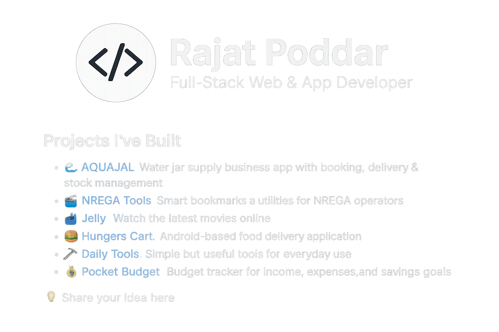

<p align="center">
  
</p>

<p align="center">
  
  
  
</p>

<h1 align="center">👋 Namaste! I'm Rajat Poddar</h1>

<p align="center">
  <a href="https://git.io/typing-svg">
    
  </a>
</p>

<p align="center"><b>🚀 I turn your ideas into live, scalable products – from concept to deployment.</b></p>

---

## 📖 About Me

```yaml
name: Rajat Poddar
role: Full-Stack Web & App Developer
location: Palojori, Deoghar, Jharkhand (India)
based_at: Poddar Enterprises

focus: [
    "Build. Ship. Scale.",
    "Automation tools that save hours every day",
    "SaaS products with real users in production",
    "Mobile & Web apps that people actually use"
]

fun_fact: "Great at building things before you even say it."
```

---

## 🧰 Languages & Tech Stack


---

## 🛠️ Featured Projects

<table align="center">
  <tr>
    <td align="center" width="50%">
      <b>🤖 NREGA_Bot</b><br/>
      <sub>Automate repetitive NREGA portal tasks.</sub><br/>
      <a href="https://nregabot.com"></a>
    </td>
    <td align="center" width="50%">
      <b>🏦 NREGA Tools</b><br/>
      <sub>Smart utilities for NREGA operators.</sub><br/>
      <a href="https://nrega.palojori.in"></a>
    </td>
  </tr>
  <tr>
    <td align="center">
      <b>🌊 AQUAJAL</b><br/>
      <sub>Water jar business: booking, delivery & stock.</sub><br/>
      <a href="https://www.aquajal.com"></a>
    </td>
    <td align="center">
      <b>🎬 Jelly</b><br/>
      <sub>Watch the latest movies online.</sub><br/>
      <a href="https://jelly.cabelwala.com"></a>
    </td>
  </tr>
</table>

---

## 📊 GitHub Analytics

<p align="center">
  
  
</p>

<p align="center">
  
</p>

<p align="center">
  
</p>

---

## 🏆 Developer Highlights

🏅 <b>Fastest Debugger of the Year – 2024</b><br/>
🥇 <b>Bug Whisperer Award – 2023</b><br/>
🎯 <b>“Built It Before You Said It” Trophy – 2022</b><br/>
🧪 <b>Code Alchemist Certification – 2021</b>

---

## 🔗 Connect With Me

<p align="center">
  <a href="https://github.com/rajatpoddar">
    
  </a>
  <a href="https://www.nregabot.com">
    
  </a>
  <a href="https://wa.me/917250580175">
    
  </a>
</p>

---

<p align="center">💡 <b>Let's Build Your Idea.</b> Just tell me what you need — I'll handle the rest.</p>
<p align="center"><a href="https://wa.me/917250580175"><b>📬 Share your Idea here</b></a></p>

<p align="center">
  Thanks for visiting! &nbsp;Let’s build something awesome together. 🚀
  <br/>
  
</p>